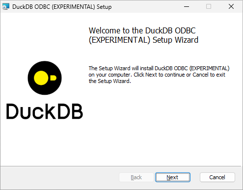
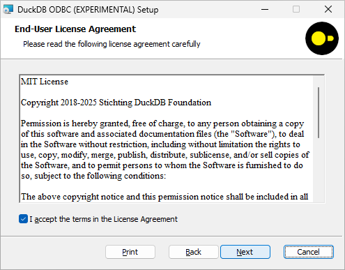
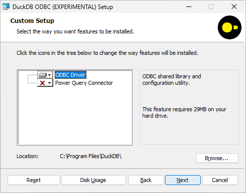
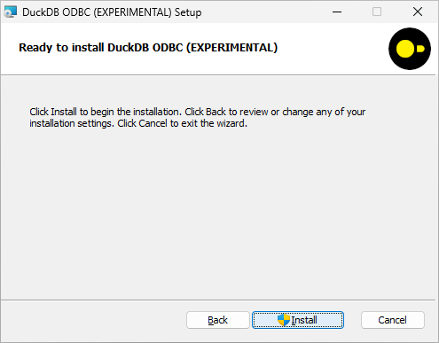
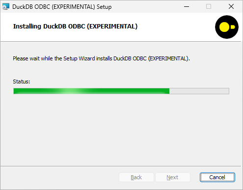
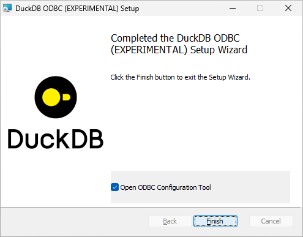
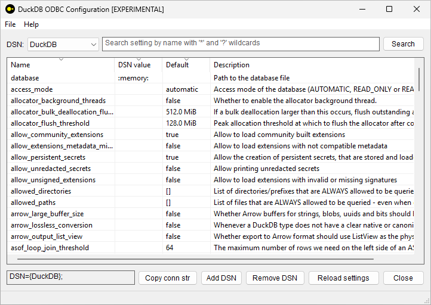

DuckDB ODBC Installer (EXPERIMENTAL)
------------------------------------

Installer for [DuckDB ODBC driver on Windows](https://duckdb.org/docs/stable/clients/odbc/windows.html) created using the latest stable version of the [WiX Toolset](https://en.wikipedia.org/wiki/WiX). Intended as a replacement for [odbc_install.exe](https://github.com/duckdb/duckdb-odbc/tree/129838e3ff6323170a23287ddb266df771218510/winsetup).

Besides the ODBC driver it also includes [DuckDB Power Query Connector by MotherDuck](https://github.com/motherduckdb/duckdb-power-query-connector) and [DuckDB ODBC Configuration Utility](https://github.com/staticlibs/duckdb-odbc-config) (that is run as a post-install action and can be used standalone).

Try it - [download duckdb_odbc.msi](https://github.com/staticlibs/duckdb-odbc-installer/releases/download/experimental-1/duckdb_odbc.msi). 

Note on code siging: in general, Windows makes it quite difficult for end users to run unsigned installers. Signing it with an [Extended Validation certificate](https://en.wikipedia.org/wiki/Extended_Validation_Certificate) is pretty much the only way to reliably distribute installers. This experimental build is signed by non-EV certificate (the only one I have access to right now), it still should allow to proceed with installations with additional UAC/confirmation screens.

